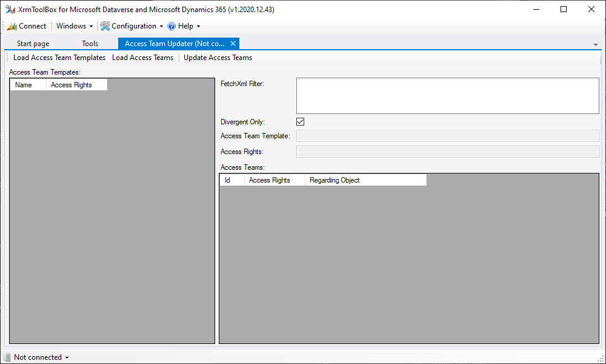
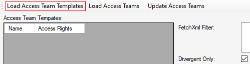
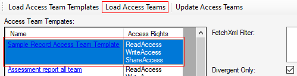
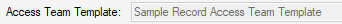
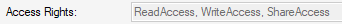
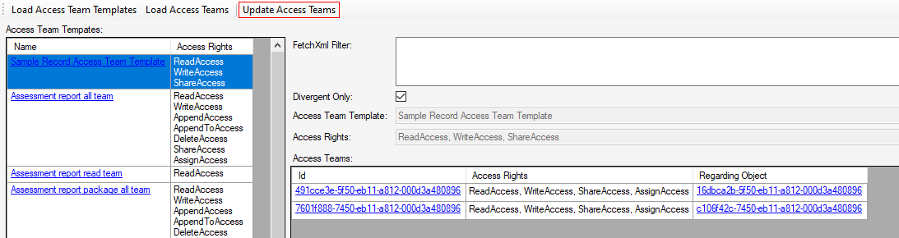

❌Unfortunately this tool is no longer supported. Microsoft changed something for the SDK Message [ModifyAccessRequest](https://docs.microsoft.com/en-us/dotnet/api/microsoft.crm.sdk.messages.modifyaccessrequest) and currently there is no alternative. 'You can't share or unshare a record with a system-generated access team.' 🤷‍♂️

# Access Team Updater
XrmToolBox plugin for updating the access rights of access teams.



## Before you start

Be sure to create a backup for your organization. Just in case...

## How to use this plugin

1. Connect to the desired organization and hit the button "Load Access Team Templates" to retrieve all Access Team Templates of your organization.

	

2. Select one of the templates and hit the button "Load Access Teams" to retrieve all teams that are associated with the selected Access Team Template.

	

* The field "Access Team Template" displays the name of the Access Team Template that was selected for querying the teams.

	

* The field "Access Rights" shows the "AccessRights" of the Access Team Template that was selected for querying the teams.

	


3. Hit the button "Update Access Teams" to set the "AccessRights" of all displayed teams according to the "Access Rights" field.

	

4. Wait for the process to finish. 
\
Optional: When it's done you can hit "Load Access Teams" again. This should result in an empty "Access Teams" list if no error occured during the updates and "Divergent Only" was selected.

## Options

* You can click the values of the link columns (Name, Id, Regarding Object) to open the records in your default browser.

* Deselect "Divergent Only" to get a list of teams regardless of whether their "AccessRights" mismatch those of the selected Access Team Template.

* You can use the field "FetchXml Filter" to limit the list of teams to be changed.
\
In the following example only those teams are retrieved/updated, where the regarding object is active:

```
<link-entity name="new_samplerecord" from="new_samplerecordid" to="regardingobjectid">
	<filter>
		<condition attribute="statecode" operator="eq" value="0" />
	</filter>
</link-entity>
```
